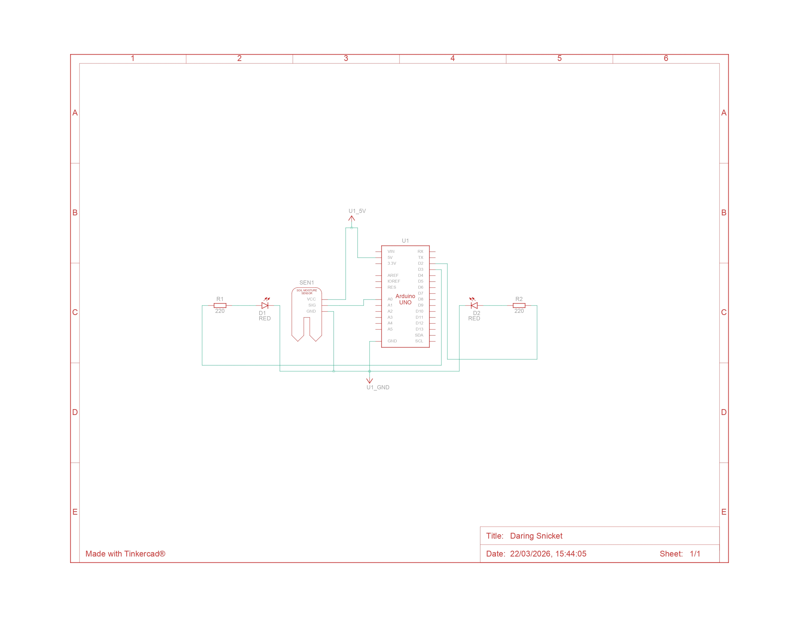

# Greenhouse
This system was developed for a smart greenhouse project.

# Diagram


# Components

* Generic Arduino UNO
* 2x Resistor 220Ω
* 2x red led
* Humidity sensor (I don't know the model, but it reads the data in the following way)
```
maximum_humidity = 0;
minimum_humidity = 1023;
```

# To Execute
To run the code, you first need to compile the `Estufa.ino` file into the Arduino (I used a generic version of the Arduino UNO) and assemble the circuit according to the diagram. It's also possible to view the code running using [Tinkercad](https://www.tinkercad.com/things/93dag2HpIBG-greenhouse-diagram?sharecode=9mpnyCX24FDGoIc5aOm5swt0EV9a-QfusJcu5RrW7pQ), but it's worth noting that the humidity sensor reads the data differently.
```
maximum_humidity = 876;
minimum_humidity = 0;
```